# Revisiting Self-Attention in Deep Reinforcement Learning: A Dimensional Perspective

## TL;DR

<div align='center'>
  Designs of self-attention modules
  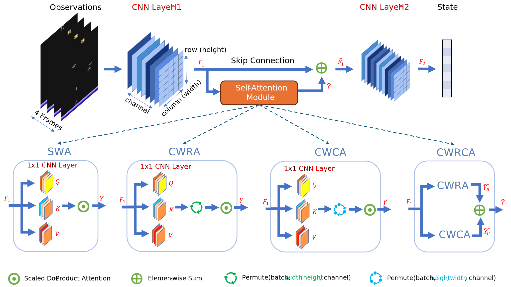
</div>

<br>

- We aim to design sample-efficient DRL algorithms by leveraging self-attention, particularly, its dimensional biases.
- We focused on visual-based DRL settings where the state is often extracted using CNNs.
- We designed various self-attention modules by altering the dimensions over which the scaled dot-product attention can be applied.
- We integrated each self-attention module into the PPO algorithm and evaluate the underlying DRL agent in the Arcade Learning Environment.
- The self-attention module together with the first CNN module form a complementary state representation learning system, guided by the same RL objective, i.e., to maximize return.
- Each self-attention module has a distinct **bias** and generates attention blocks oriented in a certain axis, either horizontally, vertically or both.
- Each Atari game also has a distinct **bias** in terms of its main axis of dynamics such as the axis of conflict, combat, competition, or movement of key objects. 
- We discovered that the DRL agent is more likely to achieve the highest sample-efficiency in games where the main axis of dynamics aligns with its attention axis. In other words, games are more likely to be won by the DRL agent whose attention axis aligns with the main axis of dynamics.
- We provided an interpretability study, showing that the **alignment of biases** helps the agent learn better policies by capturing important environmental dynamics such as the locations and trajectories of the key objects.

<!-- [Paper]()

**BibTex**

If you find our codes and paper useful, please use the following reference:
```
TBA
``` -->

## Setup

### System Info

- OS: Linux-5.15.0-33-generic-x86_64-with-glibc2.29
- Python: 3.8.5
- Stable-Baselines3: 2.0.0
- PyTorch: 1.13.0+rocm5.2 (Note: this code is tested on the [ROCm](https://github.com/ROCm/ROCm) compute platform. You may change it to PyTorch CUDA if you're using CUDA.)
- Numpy: 1.22.4
- Cloudpickle: 2.2.1
- Gymnasium: 0.28.1
- OpenAI Gym: 0.26.2

### Installation

- Create a virtual env
```bash
python -m venv venv
source venv/bin/activate
```
- Install PyTorch
```bash
# ROCm 5.2 (Linux only)
pip install torch==1.13.0+rocm5.2 torchvision==0.14.0+rocm5.2 torchaudio==0.13.0 --extra-index-url https://download.pytorch.org/whl/rocm5.2
# CUDA 11.6
pip install torch==1.13.0+cu116 torchvision==0.14.0+cu116 torchaudio==0.13.0 --extra-index-url https://download.pytorch.org/whl/cu116
# CUDA 11.7
pip install torch==1.13.0+cu117 torchvision==0.14.0+cu117 torchaudio==0.13.0 --extra-index-url https://download.pytorch.org/whl/cu117
# CPU only
pip install torch==1.13.0+cpu torchvision==0.14.0+cpu torchaudio==0.13.0 --extra-index-url https://download.pytorch.org/whl/cpu
```
- Install other dependencies
```bash
pip install -r requirements.txt
```
- Create an IPython kernel for Jupyter Notebook
```bash
python -m ipykernel install --user --name=venv
```

## Training

Launch a training run
```bash
# activate the virtual env
source venv/bin/activate
# e.g., env=PongNoFrameskip-v4, self_attn='NA', seed=0
python -u src/train.py --algo ppo  --env PongNoFrameskip-v4 --tensorboard-log logs --eval-freq 200000 --eval-episodes 5 --save-freq 500000 --log-folder logs --seed 0 --vec-env subproc --uuid \
--hyperparams policy_kwargs:"dict(features_extractor_class=SelfAttnCNNPPO, features_extractor_kwargs=dict(self_attn='NA'), net_arch=[])"
```

Launch all training runs using [PBS Pro](https://altair.com/pbs-professional)
```bash
src/launch.sh
```

## Results & Analysis

All data and codes used for results analysis can be found in the `results` folder.

### Evaluation

The evaluation data is saved as `data/post_processed_results_56.pkl` and the evaluation plots (i.e., the learning curves, performance per game, aggregate performance, sample efficiency, performance profiles, and the probability of improvement) can be reproduced using the `evaluation.ipynb`. <br>

We also report performance per game and collate the games that are won by each agent to see if there is any correlation between the inductive biases of the agents and the game mechanics.

#### Performance per Game

In total, 56 games are evaluated over 10 million time steps across 5 seeds with all games having the `NoFrameskip-v4` suffix in their environment IDs. The sample mean and standard error are computed using the mean evaluation score over the entire evaluation period across 5 runs. The ‘winner’ of each game is highlighted in bold based on the highest sample mean. <br>

Although the baseline agent (NA) has the highest number of wins, it did not win by a large margin in most cases. In addition, the combined impact of self-attention models (**33 wins**) is nontrivial and it is worth investigating how the inductive bias of each self-attention module influences the performance of the agent in different environments. <br>


|      Game      |          NA           |         SWA         |        CWRA        |         CWCA          |         CWRCA         |
|----------------|-----------------------|---------------------|--------------------|-----------------------|-----------------------|
|Alien           |713.25 ± 23.93         |783.05 ± 33.57       |**820.38 ± 55.90**  |796.17 ± 25.60         |761.62 ± 27.09         |
|Amidar          |233.81 ± 17.10         |194.72 ± 7.87        |249.74 ± 18.04      |219.80 ± 19.40         |**258.99 ± 24.00**     |
|Assault         |1206.73 ± 81.79        |**1447.24 ± 145.57** |1391.12 ± 150.19    |1105.14 ± 30.39        |1187.06 ± 141.38       |
|Asterix         |**2190.20 ± 62.24**    |2115.20 ± 120.97     |1850.88 ± 53.40     |1881.16 ± 107.32       |1751.08 ± 44.01        |
|Asteroids       |**1694.04 ± 44.22**    |1613.50 ± 41.29      |1519.31 ± 60.69     |1540.75 ± 53.98        |1515.91 ± 25.78        |
|Atlantis        |**748152.32 ± 7500.59**|706351.92 ± 8465.67  |742176.56 ± 7568.71 |717543.44 ± 15934.30   |687103.60 ± 12713.27   |
|BankHeist       |282.67 ± 99.69         |271.21 ± 96.26       |291.63 ± 71.99      |**300.24 ± 79.89**     |289.53 ± 111.95        |
|BattleZone      |**18500.80 ± 1010.68** |15742.40 ± 831.53    |17180.80 ± 1230.39  |17376.00 ± 1091.82     |14099.20 ± 1112.86     |
|BeamRider       |**2473.49 ± 169.54**   |2035.45 ± 88.45      |2394.04 ± 98.61     |2238.17 ± 70.47        |2001.04 ± 212.50       |
|Berzerk         |744.35 ± 28.95         |783.36 ± 29.50       |**859.44 ± 11.41**  |738.88 ± 28.79         |821.95 ± 30.29         |
|Bowling         |37.08 ± 1.39           |42.24 ± 3.00         |39.27 ± 3.15        |**43.77 ± 3.17**       |35.87 ± 2.61           |
|Boxing          |32.44 ± 1.67           |27.90 ± 4.80         |41.50 ± 2.62        |**44.44 ± 6.78**       |25.96 ± 3.52           |
|Breakout        |**49.17 ± 2.54**       |38.55 ± 1.92         |40.71 ± 2.99        |42.61 ± 1.84           |42.29 ± 5.29           |
|Centipede       |3171.62 ± 49.00        |3103.86 ± 34.70      |3107.74 ± 70.54     |2980.11 ± 102.51       |**3231.28 ± 56.19**    |
|ChopperCommand  |1795.84 ± 86.32        |1614.56 ± 22.34      |**1909.92 ± 72.07** |1609.76 ± 47.24        |1536.64 ± 90.13        |
|CrazyClimber    |83603.20 ± 2103.07     |79674.88 ± 2573.49   |82909.68 ± 1900.91  |**83995.60 ± 2277.56** |78799.12 ± 670.93      |
|Defender        |13075.88 ± 421.91      |12774.72 ± 483.22    |12650.36 ± 701.04   |**15035.48 ± 679.71**  |14171.84 ± 656.77      |
|DemonAttack     |4276.36 ± 148.32       |**4526.02 ± 245.87** |4430.51 ± 376.03    |4059.09 ± 63.70        |3695.32 ± 103.82       |
|DoubleDunk      |**-6.13 ± 0.31**       |-6.78 ± 0.32         |-6.15 ± 0.22        |-6.20 ± 0.29           |-6.32 ± 0.14           |
|Enduro          |**176.80 ± 43.35**     |162.52 ± 25.48       |129.54 ± 32.08      |112.26 ± 17.96         |106.03 ± 35.66         |
|FishingDerby    |-70.46 ± 3.11          |-78.18 ± 1.37        |-72.74 ± 2.99       |**-66.00 ± 2.19**      |-71.96 ± 2.20          |
|Freeway         |**29.23 ± 0.28**       |28.73 ± 0.43         |23.74 ± 4.05        |24.33 ± 5.44           |23.24 ± 5.20           |
|Frostbite       |270.59 ± 2.60          |268.18 ± 2.46        |279.81 ± 3.50       |**676.94 ± 364.66**    |266.51 ± 3.07          |
|Gopher          |893.97 ± 21.91         |896.82 ± 28.77       |**954.93 ± 21.44**  |913.07 ± 18.05         |917.46 ± 9.25          |
|Gravitar        |**328.68 ± 20.12**     |318.76 ± 18.17       |295.28 ± 8.63       |299.40 ± 9.79          |261.36 ± 8.32          |
|Hero            |9045.84 ± 116.65       |8435.23 ± 393.62     |9153.70 ± 280.52    |9071.00 ± 282.13       |**9877.38 ± 145.04**   |
|IceHockey       |**-4.78 ± 0.13**       |-5.06 ± 0.19         |-4.93 ± 0.08        |-4.97 ± 0.14           |-4.90 ± 0.08           |
|Jamesbond       |609.08 ± 88.48         |480.32 ± 14.36       |**693.60 ± 119.26** |457.88 ± 14.61         |452.44 ± 30.54         |
|Kangaroo        |1504.24 ± 272.96       |1503.60 ± 181.72     |**1886.56 ± 291.60**|1250.56 ± 103.63       |1252.64 ± 292.68       |
|Krull           |5537.86 ± 196.97       |4970.93 ± 149.33     |5189.49 ± 107.28    |**5763.52 ± 166.26**   |5095.27 ± 185.98       |
|KungFuMaster    |**17357.68 ± 700.29**  |17260.96 ± 1426.21   |17050.72 ± 1425.88  |17110.80 ± 725.67      |13422.16 ± 1048.28     |
|MontezumaRevenge|0.72 ± 0.49            |0.40 ± 0.28          |0.48 ± 0.18         |0.48 ± 0.35            |**2.16 ± 1.25**        |
|MsPacman        |**772.44 ± 15.97**     |699.65 ± 10.00       |717.33 ± 38.01      |686.30 ± 23.43         |669.47 ± 8.52          |
|NameThisGame    |**5176.36 ± 79.77**    |4668.89 ± 81.98      |5116.64 ± 81.12     |4812.22 ± 223.28       |4493.71 ± 178.70       |
|Phoenix         |4200.87 ± 103.45       |4206.65 ± 185.15     |4194.28 ± 52.70     |**4367.82 ± 92.50**    |4106.22 ± 142.62       |
|Pitfall         |**-7.66 ± 1.37**       |-16.36 ± 5.65        |-28.05 ± 11.92      |-10.73 ± 3.88          |-11.98 ± 1.80          |
|Pong            |9.91 ± 0.53            |8.32 ± 0.74          |7.30 ± 1.60         |**12.64 ± 0.43**       |-0.02 ± 4.01           |
|PrivateEye      |93.06 ± 1.64           |87.12 ± 9.55         |88.90 ± 2.55        |84.64 ± 2.99           |**109.90 ± 22.71**     |
|Qbert           |**1594.34 ± 74.58**    |1228.14 ± 63.00      |1467.60 ± 87.12     |1425.32 ± 128.60       |1128.26 ± 93.87        |
|Riverraid       |4098.34 ± 319.24       |4464.29 ± 101.54     |**4548.46 ± 177.25**|4468.96 ± 268.44       |3822.38 ± 252.04       |
|RoadRunner      |**17679.60 ± 1207.69** |14792.88 ± 1527.42   |15625.60 ± 1066.88  |15596.96 ± 541.54      |13924.72 ± 1252.82     |
|Robotank        |**15.76 ± 0.87**       |14.44 ± 0.64         |14.27 ± 0.63        |13.16 ± 0.64           |10.28 ± 0.92           |
|Seaquest        |**865.14 ± 2.13**      |845.89 ± 3.02        |854.10 ± 3.70       |851.44 ± 1.49          |843.82 ± 4.34          |
|Skiing          |-28852.89 ± 549.36     |-21709.29 ± 4541.60  |-21695.07 ± 4566.52 |-17406.93 ± 4598.34    |**-13266.78 ± 3785.99**|
|Solaris         |**2344.58 ± 47.87**    |2332.13 ± 70.77      |2199.54 ± 43.66     |2278.88 ± 43.55        |2337.78 ± 78.62        |
|SpaceInvaders   |515.05 ± 8.99          |**532.38 ± 13.09**   |504.85 ± 9.32       |516.86 ± 16.91         |487.15 ± 5.81          |
|StarGunner      |8952.08 ± 569.54       |8824.72 ± 509.83     |9063.12 ± 587.46    |**9602.56 ± 468.26**   |8372.16 ± 919.90       |
|Tennis          |-16.09 ± 2.41          |**-11.09 ± 1.75**    |-16.20 ± 1.74       |-13.36 ± 2.31          |-11.90 ± 0.85          |
|TimePilot       |**4938.48 ± 148.33**   |4501.84 ± 154.27     |4330.56 ± 194.76    |4789.36 ± 145.20       |4369.52 ± 190.30       |
|Tutankham       |**160.79 ± 1.80**      |160.08 ± 2.57        |156.58 ± 2.36       |158.20 ± 1.88          |156.87 ± 3.24          |
|UpNDown         |49361.81 ± 15012.83    |35094.31 ± 1432.76   |59758.81 ± 17960.40 |**64822.30 ± 15476.49**|23096.82 ± 2146.71     |
|Venture         |**13.12 ± 4.82**       |5.28 ± 2.34          |8.16 ± 6.26         |4.16 ± 2.06            |3.68 ± 2.26            |
|VideoPinball    |25318.44 ± 287.01      |**25979.93 ± 654.44**|25669.86 ± 885.77   |24888.83 ± 899.18      |25354.74 ± 833.24      |
|WizardOfWor     |3415.92 ± 168.71       |3100.56 ± 229.14     |**3819.76 ± 145.49**|3475.28 ± 294.38       |3504.88 ± 134.35       |
|YarsRevenge     |13977.03 ± 1935.09     |13141.56 ± 357.95    |10376.39 ± 1936.01  |**15025.78 ± 523.89**  |13697.67 ± 582.27      |
|Zaxxon          |5381.20 ± 603.69       |4293.04 ± 1237.78    |5872.40 ± 619.70    |**6504.00 ± 498.32**   |5719.60 ± 828.21       |
|**No. of wins** |23                     |5                    |8                   |14                     |6                      |


<!-- Uncomment the section below to see the list of games won by each agent.  -->

<!-- #### Games Won by Each Agent

We group games that are won by each agent to spot any commonalities. <br>

<div align='center'>
  Games won by the PPO baseline
  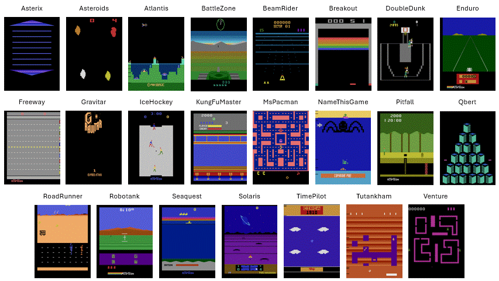
</div>

<br>

<div align='center'>
  Games won by the SWA agent
  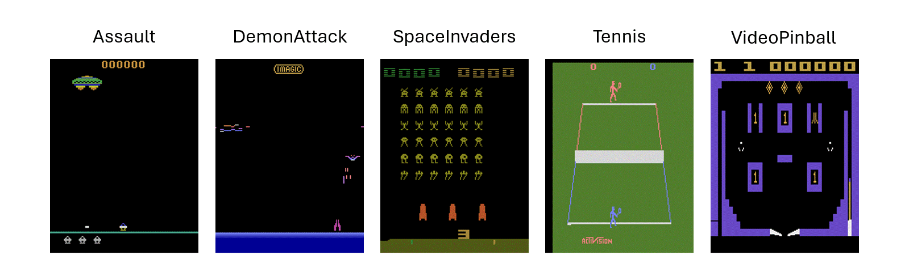
</div>

<br>

<div align='center'>
  Games won by the CWRA agent
  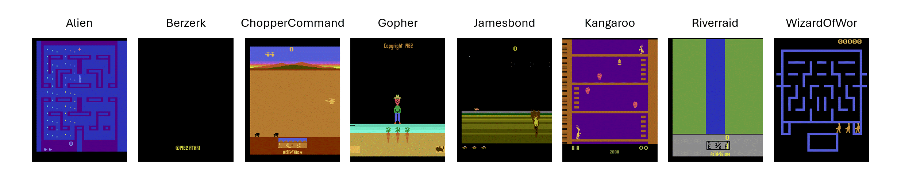
</div>

<br>

<div align='center'>
  Games won by the CWCA agent
  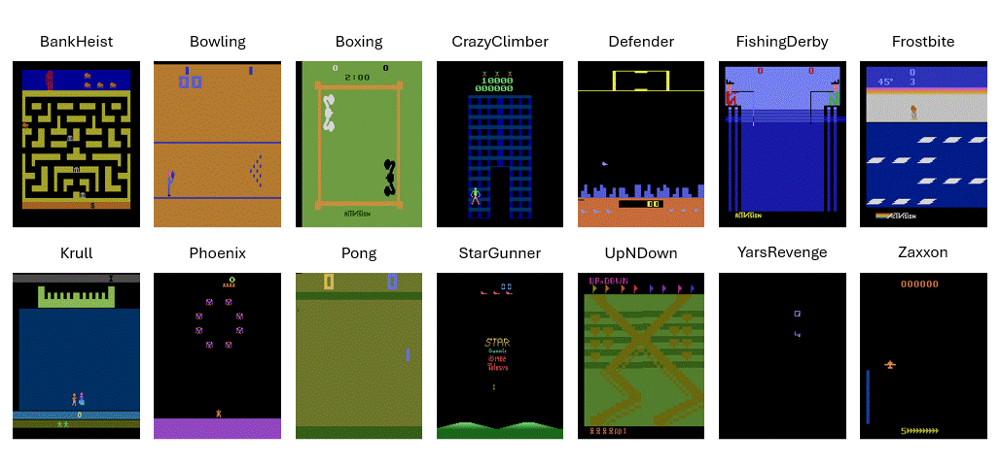
</div>

<br>

<div align='center'>
  Games won by the CWRCA agent
  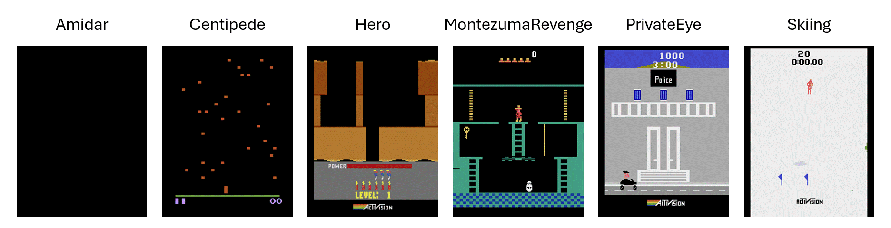
</div> -->


### Interpretability

The data used for the interpretability study are stored in the `model` folder where the observations are saved as `.npy` files and the model checkpoints are saved as `.zip` archives. <br>

The model checkpoint filenames use the same naming convention as \<Game Name\>\_\<Self-Attention Model Type\>\_\<Seed\>\_model\_checkpoint\_\<Timesteps\>\_steps.zip. <br>
E.g., Pong_CWCA_42_model_checkpoint_3000000_steps.zip has the following information.
- Game Name: Pong
- Self-Attention Model Type: CWCA
- Seed: 42
- Timesteps: 3 Million timesteps

The plots from the interpretability study can be reproduced using the `interpretability_<game>.ipynb`. <br>

#### State Representation

Based on the state presentations of Pong and Assault, we observed that
- The self-attention module together with the first CNN module form a complementary state representation learning system. E.g., cold regions in the rectified feature maps at H1 correspond to hot regions in the attention maps.
- Each self-attention module has a distinct dimensional bias and generates attention blocks oriented in a certain axis, either horizontally, vertically or both.
- The attention blocks generated by the self-attention modules help capture important game dynamics such as the trajectories of the ball and projectiles.

<div align='center'>
  State representations of Pong (left) and Assault (right)
  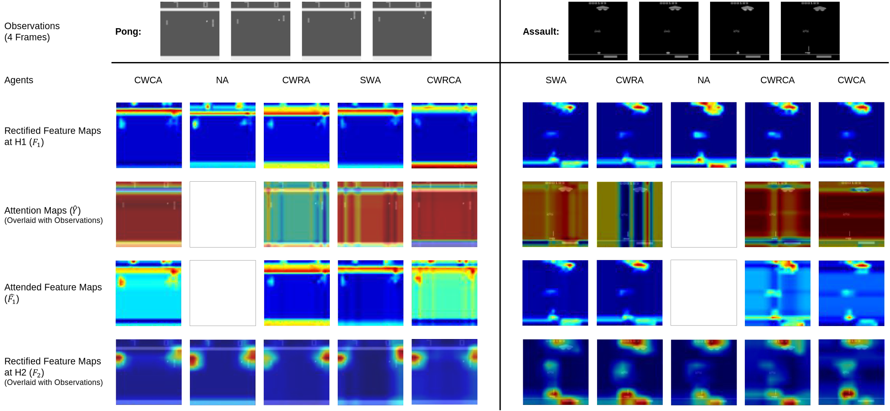 
</div>


#### Game Classification

Based on the orientations of the attention patterns, we classify games based on their main axes of dynamics. We define the axis of dynamics as the axis of interaction, such as conflict, combat, competition or movements of key objects.
- **Horizontal**: The game’s main axis of dynamics is oriented horizontally - _Bowling, Boxing, ChopperCommand, Defender, FishingDerby, Frostbite, KungFuMaster, Pong, RoadRunner, Seaquest, StarGunner, YarsRevenge_ (**12 games**)
- **Vertical**: The game’s main axis of dynamics is oriented vertically - _Assault, Atlantis, Breakout, Centipede, CrazyClimber, DemonAttack, DoubleDunk, Gopher, IceHockey, Jamesbond, Kangaroo, NameThisGame, Phoenix, Riverraid, Skiing, SpaceInvaders, Tennis, Zaxxon_ (**18 games**)
- **Others**
  - Games have no main axis of dynamics (e.g., exploration and action-adventure games) - _Hero, Krull, MontezumaRevenge, Pitfall, PrivateEye_ (**5 games**)
  - The game’s main axis of dynamics is far off the horizontal or vertical direction (e.g., games with a first-person, third-person, or 3D perspective) - _BattleZone, BeamRider, Enduro, Robotank, Solaris_ (**5 games**)
  - Games have more than one axis of dynamics (e.g., multi-directional shooters, maze, or puzzle games) - _Alien, Amidar, Asterix, Asteroids, BankHeist, Berzerk, Freeway, Gravitar, MsPacman, Qbert, TimePilot, Tutankham, UpNDown, Venture, VideoPinball, WizardOfWor_ (**16 games**)
  - Total 26 games

<br>

<ins>Games with a horizontal main axis of dynamics</ins>


<div align='center'>
  Games with a horizontal main axis of dynamics
   
</div>

<br>

<ins>Games with a vertical main axis of dynamics</ins>


<div align='center'>
  Games with a vertical main axis of dynamics
  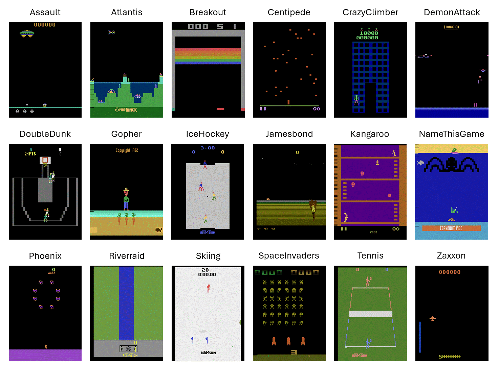 
</div>

<br>

<ins>Games with other dynamics</ins>


<div align='center'>
  Games with other dynamics - no main axis of dynamics
  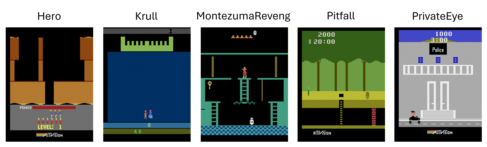 
</div>

<br>

<div align='center'>
  Games with other dynamics - the main axis of dynamics is far off the horizontal or vertical direction
   
</div>

<br>

<div align='center'>
  Games with other dynamics - multiple main axes of dynamics
  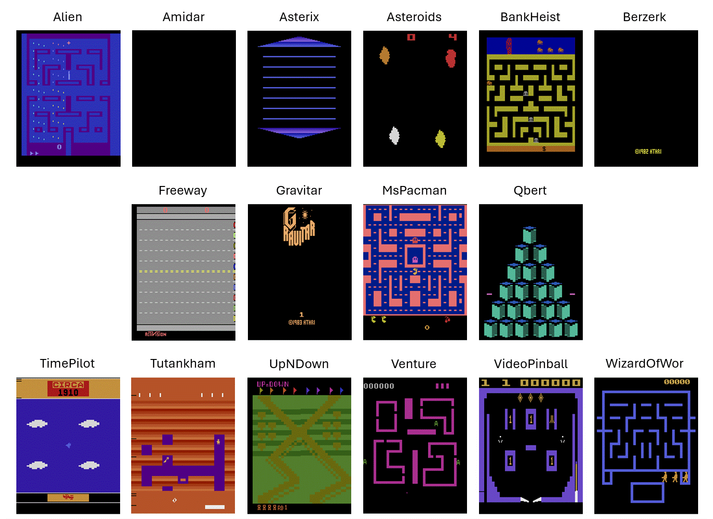 
</div>


#### Alignment of Biases

The table below provides guidance when selecting agents for a particular game. The number represents the likelihood of winning by each agent.
- Games with a horizontal main axis of dynamics are more likely to be won by the horizontal attention generator, i.e., the `CWCA` agent which produces horizontal attention blocks.
- Games with a vertical main axis of dynamics are more likely to be won by the vertical attention generators, i.e., `SWA` and `CWRA` agents which produce vertical attention blocks. The combined probability of `SWA` and `CWRA` is the highest.
- Games with more than one axis of dynamics, main axis of dynamics that is far off the horizontal or vertical direction, or no main axis of dynamics are more likely to be won by the `NA` agent. In other words, self-attention agents exhibit limited advantages in these games due to 'misalignment of biases'.

<div align='center'>
  Winning statistics by the main axis of dynamics
  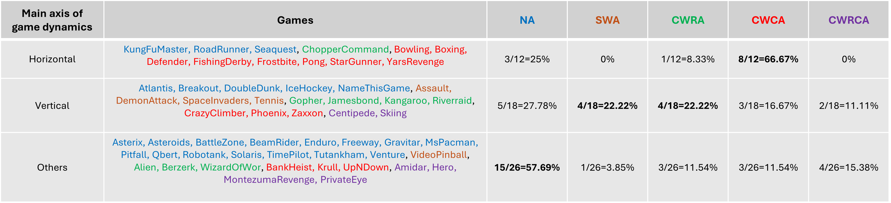
</div>

## Credits

- [PyTorch](https://github.com/pytorch/pytorch)
- [Stable Baselines3](https://github.com/DLR-RM/stable-baselines3)
- [RL Baselines3 Zoo](https://github.com/DLR-RM/rl-baselines3-zoo)
- [Gymnasium](https://gymnasium.farama.org/)
- [rliable](https://github.com/google-research/rliable)
- [pytorch-gradcam](https://github.com/vickyliin/gradcam_plus_plus-pytorch)


